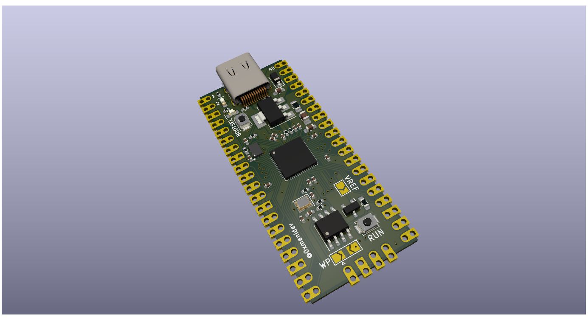

# dev-board
this is a project made for hackclub blueprint event I made this project to get more into pcb design and electronics this is a stepping stone for me because I always been a software kind of guy

I used rp2040 from raspberry pi as micro controller I taken inspiration from pico and improved it based on my learning like pwm etc..

I chose rp2040 because it has great support with circuit python and that's the language I am familiar with.

I journalled everything in hack club https://blueprint.hackclub.com/projects/13798

made with ❤️ and with the help of hack club community

